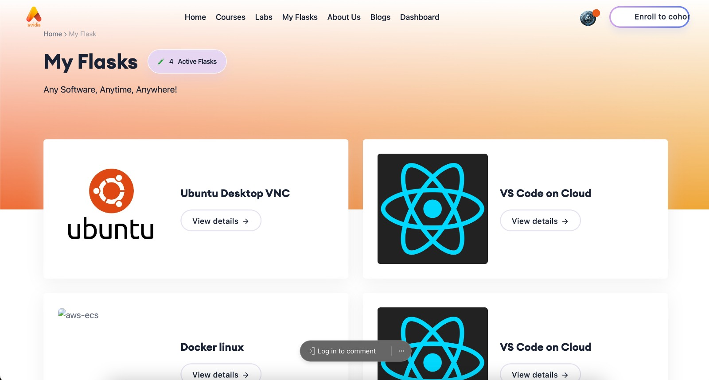
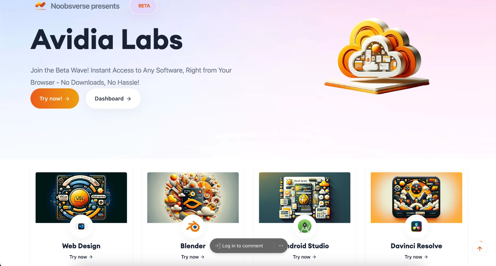
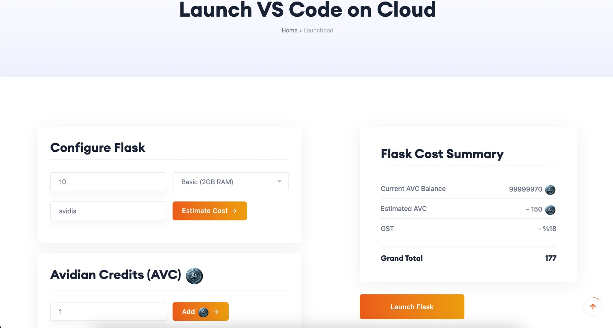
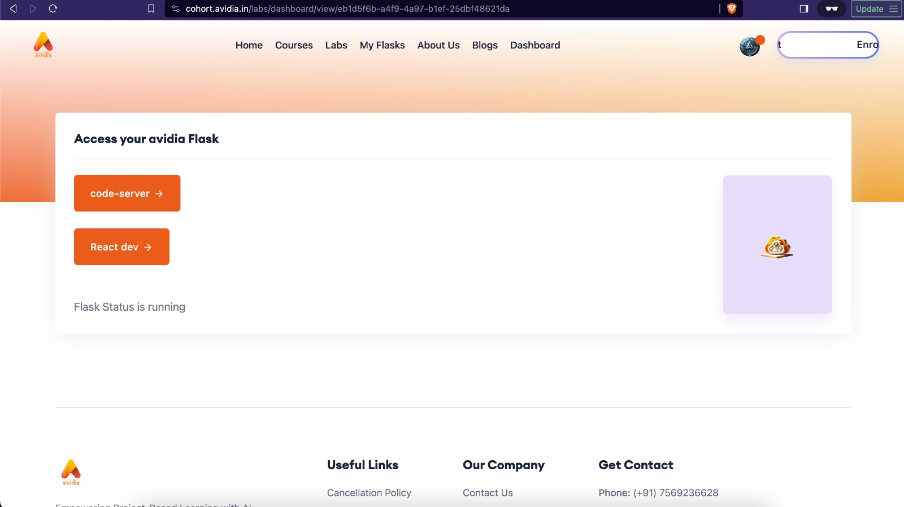
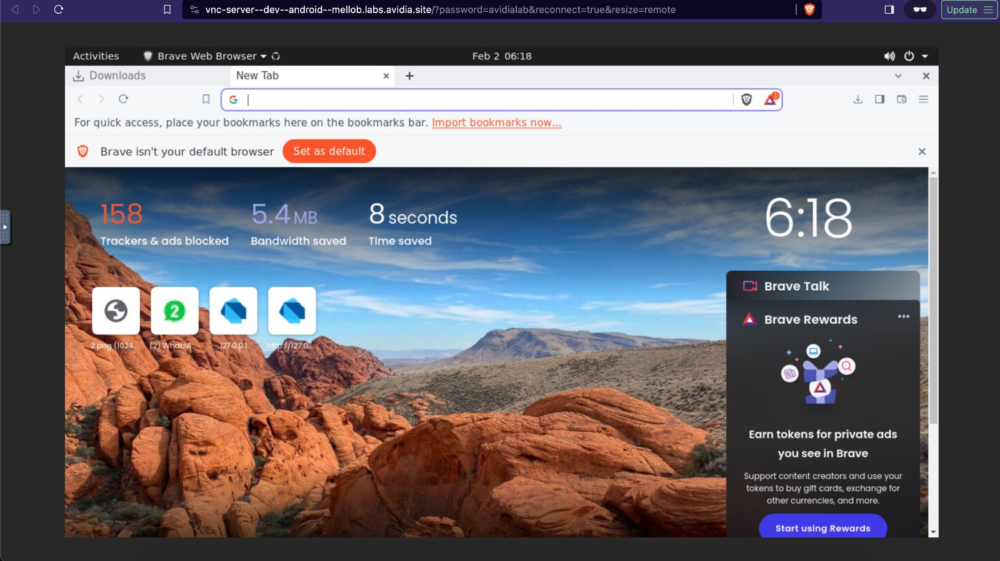
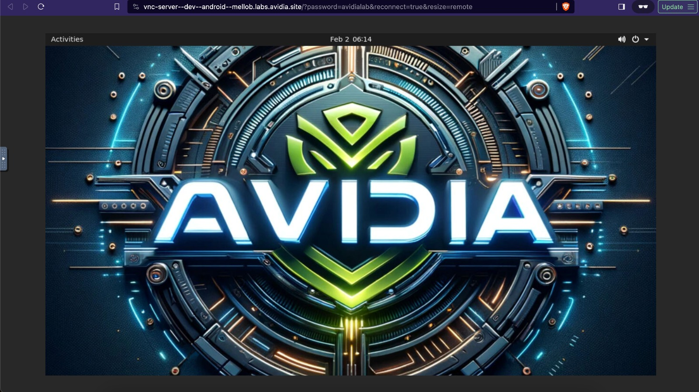
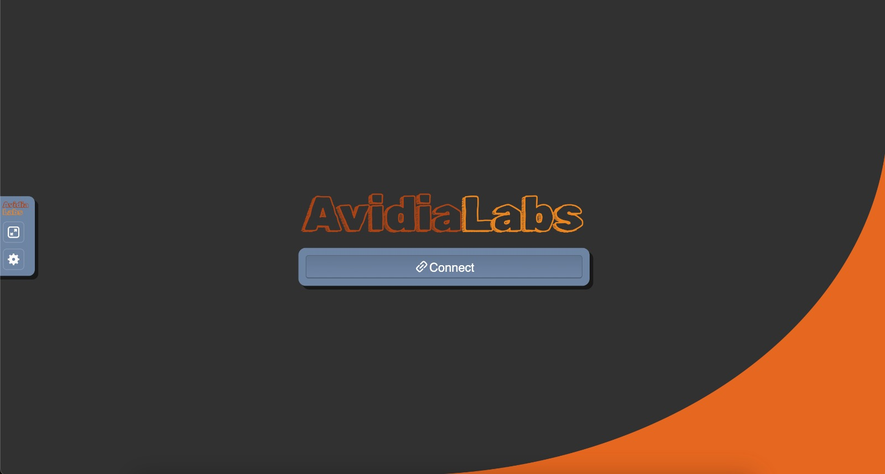

# Avidia - Overview

## Introduction

This document provides an overview of a cutting-edge cloud platform designed specifically for students. Leveraging AWS services and modern technologies like Terraform, Ansible, Docker, GraphQL, DynamoDB, AWS AppSync, AWS Amplify, ECS, TailwindCSS, and Shadcn, this platform offers a seamless experience for accessing various software tools directly from a browser using the VNC protocol. The platform is enriched with features such as live sessions, quizzes, handouts (assignments), practice labs, and AI mentors to enhance the learning experience.

## Features and Technologies

### Deployment and Infrastructure

- **Terraform**: Used for writing declarative infrastructure as code (IaC) scripts to provision and manage any cloud, infrastructure, or service.
- **Ansible**: Automates software provisioning, configuration management, and application deployment, ensuring consistent environments.
- **Docker**: Containers encapsulate software, libraries, and dependencies, facilitating easy deployment and scalability.

### Accessing Software Tools

- **VNC Protocol**: Enables remote access to software tools like Blender, Unreal Engine, and VSCode, allowing them to run directly from a browser.

### Backend Technologies

- **GraphQL**: A query language for APIs, offering a complete and understandable description of the data in the API, and allowing clients to ask for exactly what they need.
- **DynamoDB**: A fast and flexible NoSQL database service for all applications that need consistent, single-digit millisecond latency at any scale.
- **AWS AppSync**: Manages and secures access to data sources, real-time data synchronization, and user-specific data.
- **AWS Amplify**: Provides a set of tools and services that enable mobile and front-end web developers to build secure, scalable full-stack applications.
- **ECS (Amazon Elastic Container Service)**: A highly scalable, high-performance container management service that supports Docker containers.

### Frontend Technologies

- **TailwindCSS**: A utility-first CSS framework for rapidly building custom designs.
- **Shadcn**: A lightweight UI framework for crafting fast, reactive web interfaces.

### Enhanced Learning Features

- **Live Sessions**: Integrated technology supports real-time interactions between students and instructors.
- **Quizzes**: Tools to create and manage quizzes for testing knowledge.
- **Handouts (Assignments)**: Mechanisms for distributing and managing assignments.
- **Practice Labs**: Virtual lab environments where students can gain hands-on experience.
- **AI Mentors**: AI-driven assistance for personalized learning guidance and support.

## Platform Interfaces
### Main Dashboard

### Home Page

### Launch Flask Interface

### Access Flask

### Demo 1

### Demo 2

### Demo 3

## Conclusion

This cloud platform represents a comprehensive solution for educational environments, blending modern technologies with essential learning tools. It provides a robust, scalable infrastructure for accessing a wide range of software directly from the web, alongside features that enhance teaching and learning experiences. Through its innovative use of AWS services and cutting-edge technologies, the platform is poised to revolutionize how students and educators interact with digital resources.

---

This document is a high-level overview intended to introduce the platform's capabilities and the technologies behind them. For detailed implementation guidelines, architectural diagrams, and code samples, further documentation should be consulted.
